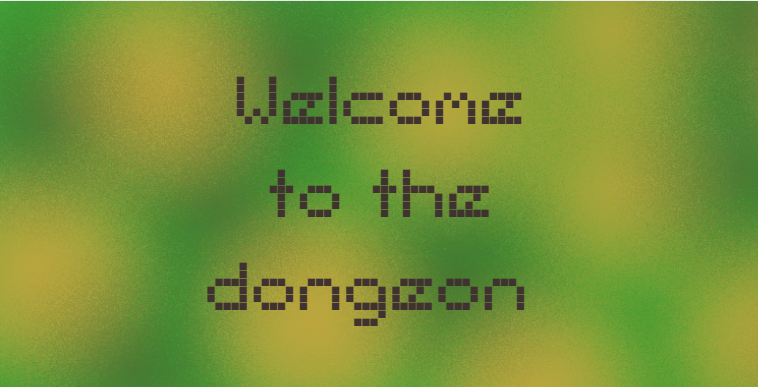
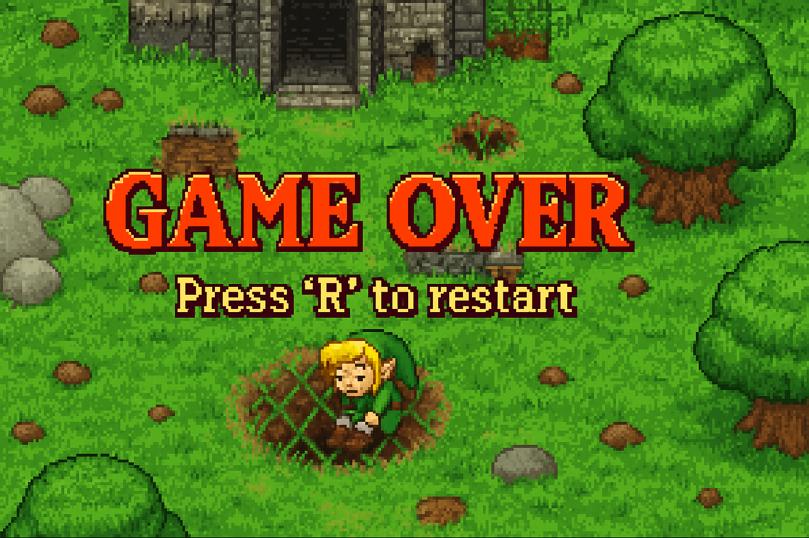

# TD5_S6_Projet_JAVA
GitHub pour le projet Java de S6 à l'ENSEA, en binôme avec Laure WOLFF


## 🏃‍♂️ Projet Jeu Java : Héros en Action

Ce projet Java présente un jeu simple et divertissant où le joueur incarne un héros qui peut courir, marcher ou s'arrêter tout en évitant différents obstacles pour arriver à la fin de chaque niveau.

## 🎮 Contrôles du jeu

- **Courir** : Appuyer sur la touche `F`
- **Marcher** : Appuyer sur la touche `S`
- **S'arrêter** : Appuyer sur la touche `Espace`

## 🌳 Obstacles et pièges

Tout au long de son parcours, le héros devra éviter trois types d'obstacles :
- 🪨 **Roches** : Impossibles à traverser
- 🌲 **Arbres** : Bloquent le chemin
- ⚠️ **Pièges** : Marcher dessus déclenche immédiatement un Game Over !

## 🌎 Fonctionnalités

### Niveau 1 :
Le premier niveau est fixe et permet au joueur de s'habituer aux mécaniques du jeu.

### Niveau 2 (et suivants) : Génération aléatoire
À partir du niveau 2, chaque carte est générée aléatoirement tout en garantissant toujours au moins un chemin valide grâce à un algorithme de génération de labyrinthe.

Voici un aperçu simplifié de l'algorithme utilisé pour générer automatiquement les niveaux :

```java
public static void generateLevel2() {
        Random random = new Random();
        char[][] grid = new char[HEIGHT][WIDTH];
        
        // Initialisation des bordures
        for (int y = 0; y < HEIGHT; y++) {
            Arrays.fill(grid[y], TREE);
        }
        // Génération des points d'entrée/sortie
        int startY = 6; // Position fixe pour l'exemple
        int endY = 6;
        grid[startY][0] = EMPTY;
        grid[endY][WIDTH - 1] = EMPTY;

        // Algorithme de génération de labyrinthe
        Stack<int[]> stack = new Stack<>();
        stack.push(new int[]{startY, 1}); // Commence à côté de l'entrée
        
        while (!stack.isEmpty()) {
            int[] current = stack.peek(); //On regarde l'élément au dessus de la stack sans l'enlever
            int y = current[0];
            int x = current[1];
            
            List<int[]> neighbors = new ArrayList<>();
            
            // Détection des voisins non visités
            if (y > 1 && grid[y - 2][x] == TREE) neighbors.add(new int[]{y - 2, x});
            if (y < HEIGHT - 2 && grid[y + 2][x] == TREE) neighbors.add(new int[]{y + 2, x});
            if (x > 1 && grid[y][x - 2] == TREE) neighbors.add(new int[]{y, x - 2});
            if (x < WIDTH - 2 && grid[y][x + 2] == TREE) neighbors.add(new int[]{y, x + 2});

            if (!neighbors.isEmpty()) {
                int[] next = neighbors.get(random.nextInt(neighbors.size()));
                int ny = next[0];
                int nx = next[1];
                
                // Creuser le chemin
                grid[ny][nx] = EMPTY;
                grid[(y + ny)/2][(x + nx)/2] = EMPTY; // Mur entre
                stack.push(next);
            } else {
                stack.pop();
            }
        }

        // Connexion garantie à la sortie
        for (int y = endY - 1; y <= endY + 1; y++) {
            if (y >= 0 && y < HEIGHT) {
                grid[y][WIDTH - 2] = EMPTY;
            }
        }

        // Ajout des obstacles aléatoires
        for (int y = 1; y < HEIGHT - 1; y++) {
            for (int x = 1; x < WIDTH - 1; x++) {
                if (grid[y][x] == TREE && random.nextFloat() < 0.3) {
                    grid[y][x] = switch(random.nextInt(3)) {
                        case 0 -> ROCK;
                        case 1 -> TRAP;
                        default -> TREE;
                    };
                }
            }
        }

        // Écriture du fichier
        try (FileWriter writer = new FileWriter("./data/level2.txt")) {
            for (char[] row : grid) {
                writer.write(new String(row) + "\n");
            }
            System.out.println("Level2 généré avec succès !");
        } catch (IOException e) {
            e.printStackTrace();
        }
    }
```

Chaque génération du niveau est sauvegardée dans un fichier texte `level2.txt`.

## 📷 Captures d'écran

Voici à quoi ressemble l'interface du jeu :

- **Écran d'accueil** :


- **Écran Game Over** :



---

**Bon jeu à tous !** 🎲🏅
